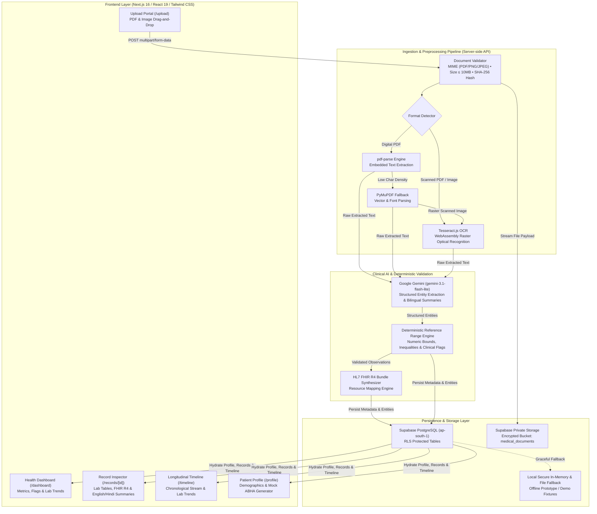

# LifeCare AI — Comprehensive Architecture, FHIR Standards & System Specification

LifeCare AI is an AI-powered personal health copilot built for the Altrix Labs Hackathon Challenge: *"AI-Powered Personal Health Copilot"*. It bridges the gap between complex, fragmented clinical documents and actionable, plain-language patient understanding through medical document OCR, structured entity extraction, deterministic reference range evaluation, longitudinal lab trends, and an ABDM/FHIR-ready architecture.

---

## 1. End-to-End System Architecture



---

## 2. Processing Pipeline Specification

| Stage | Module | Primary Engine | Fallback / Safeguard | Output |
| :--- | :--- | :--- | :--- | :--- |
| **1. Validation** | `src/lib/pipeline/documentValidator.ts` | Magic-byte MIME detection & SHA-256 hash calculation | 10MB limit enforcement & duplicate detection | Validated file buffer & hash |
| **2. Text Extraction** | `src/lib/pipeline/textExtractor.ts` | `pdf-parse` v2 (class-based Uint8Array isolation) | PyMuPDF (`scripts/extract_pdf.py`) with memory buffer clone | Plain text or rendered raster PNG |
| **3. OCR Processing** | `src/lib/pipeline/textExtractor.ts` | `tesseract.js` WebAssembly OCR | Automatic image conversion of 0-text scanned PDFs | Character stream with confidence score |
| **4. AI Structuring** | `src/lib/pipeline/geminiExtractor.ts` | `gemini-3.1-flash-lite` with structured prompt schema | Strict Zod validation (`src/lib/types/medical.ts`) | Typed observations, medications, diagnoses, summaries |
| **5. Range Validation** | `src/lib/pipeline/referenceRangeValidator.ts` | Deterministic interval/inequality parsing engine | Suppresses diagnostic claims; marks unstated bounds as `UNCLASSIFIED` | Standardized flags: `NORMAL`, `HIGH`, `LOW`, `CRITICAL` |
| **6. Plain-Language Summary**| `src/lib/pipeline/healthSummary.ts` | Grounded educational narrative | Mandatory clinical disclaimer & doctor questions | English narrative & Hindi translation |
| **7. Longitudinal Trends**| `src/components/LabTrendsComparison.tsx` | Canonical test name normalization & unit compatibility validation | Suppresses math comparison if units differ | Chronological deltas, percentages, trajectory |

---

## 3. Database Schema & ABDM / HL7 FHIR R4 Readiness

LifeCare AI employs a normalized relational schema on Supabase PostgreSQL (Mumbai region `ap-south-1`) aligned 1:1 with HL7 FHIR Release 4 resource paradigms:

### Relational Tables & FHIR Resource Mapping

| PostgreSQL Table | Target FHIR R4 Resource | Purpose & Key Mapped Fields |
| :--- | :--- | :--- |
| `profiles` | [`Patient`](https://hl7.org/fhir/R4/patient.html) | Patient demographics (`fullName`, `age`, `gender`, `bloodGroup`), emergency contact, chronic conditions, and 14-digit mock ABHA ID (`identifier.value`). |
| `medical_documents` | [`DocumentReference`](https://hl7.org/fhir/R4/documentreference.html) | Document provenance, SHA-256 hash (`content.attachment.hash`), MIME type, storage path (`content.attachment.url`), and extraction method. |
| `extracted_observations` | [`Observation`](https://hl7.org/fhir/R4/observation.html) | Laboratory investigations (`code.text`), numerical values (`valueQuantity.value`), units (`valueQuantity.unit`), reference ranges (`referenceRange`), and evaluation flags (`interpretation`). |
| `medications` | [`MedicationStatement`](https://hl7.org/fhir/R4/medicationstatement.html) / `MedicationRequest` | Prescribed drugs (`medicationCodeableConcept`), dosage (`dosage.text`), dosing frequency, duration, route, and clinical administration instructions. |
| `diagnoses` | [`Condition`](https://hl7.org/fhir/R4/condition.html) | Stated medical diagnoses (`code.text`), optional ICD-10 coding (`code.coding.code`), clinical status (`clinicalStatus`), and physician notes. |
| `document_summaries` | [`DiagnosticReport`](https://hl7.org/fhir/R4/diagnosticreport.html) | Executive clinical conclusions (`conclusion`), plain-language English explanation, Hindi regional translation, and suggested doctor questions. |

### FHIR R4 Bundle Export Route
Every processed document record is dynamically convertible into a compliant HL7 FHIR R4 Collection Bundle via:
- Endpoint: `GET /api/records/[id]/fhir`
- Interactive Inspector: Tab **"FHIR R4 Bundle"** on `/records/[id]` with one-click JSON clipboard copy and file download.

---

## 4. ABDM & Mock ABHA ID Workflow

- **Demonstration Scope:** In full accordance with hackathon evaluation standards, LifeCare AI prototypes Ayushman Bharat Digital Mission (ABDM) integration using a mock sandbox architecture. It does NOT claim live production connection to government registries.
- **ABHA Format Validation:** Supports the official National Health Authority 14-digit format: `XX-XXXX-XXXX-XXXX` (e.g., `14-8892-4102-7719`).
- **Interactive Workflow (`/profile`):**
  1. Users can view their current ABHA ID.
  2. Click **"Generate New"** to create a valid 14-digit mock ABHA identifier.
  3. Interactive validation pill verifies formatting compliance.
  4. One-click copy for sandbox FHIR exchange.

---

## 5. Supported Formats, Clinical Safety & Boundaries

### Supported Ingestion Formats
- **Digital PDFs:** Standard laboratory reports, pathology printouts, and digital hospital discharge summaries.
- **Scanned Raster PDFs:** Flat multi-page scanned documents automatically rasterized and processed via OCR.
- **Digital Images:** High-resolution PNG and JPEG scans of clinic prescriptions and outpatient records.

### Clinical Safety Boundaries & Guardrails
1. **No Autonomous Diagnosing:** The copilot strictly distinguishes documented facts from plain-language educational summaries. It never invents medical diagnoses or suggests altering prescription dosages.
2. **Deterministic Range Evaluation:** Laboratory abnormal flags (`HIGH`, `LOW`, `NORMAL`) are derived strictly from the laboratory-supplied reference bounds in the document. The system never injects arbitrary synthetic ranges.
3. **Ambiguity & Low Confidence:** Missing doctor names, illegible dates, unstated reference ranges, or qualitative findings are safely marked with `UNCLASSIFIED` flags and assigned a `requiresReview` flag.
4. **Unit Safety in Longitudinal Trends:** When comparing historical laboratory values over time, mathematics (deltas and percentages) are only calculated when measurement units are identical (e.g. `mg/dL` to `mg/dL`). If units differ (e.g., `g/dL` vs `mg/dL`), direct arithmetic is suppressed and a clear safety notice is displayed.
5. **Clear Medical Disclaimer:** Every AI-generated summary includes a persistent notice advising users to consult licensed healthcare providers.

---

## 6. Reproducible Test Instructions

```bash
# 1. Type Safety Check
npx tsc --noEmit

# 2. Production Build Check
npm run build

# 3. Unit & Integration Test Suite
npm test

# 4. End-to-End Route Verification Suite
npx tsx scripts/e2e_verification.ts

# 5. Comprehensive 5-Document Healthcare Benchmark Suite
npx tsx scripts/test_all_synthetic_documents.ts
```

---

## 7. 3-Minute Hackathon Demo Script (Evaluator Walkthrough)

### Minute 1: Document Upload & Multi-Engine Extraction (0:00 - 1:00)
1. **Navigate to `/upload`:** Point out supported file formats (PDF, PNG, JPG up to 10MB).
2. **Upload `synthetic_lab_blood_test.pdf` or `synthetic_prescription.png`:**
   - Watch real-time multi-stage pipeline: Validation $\rightarrow$ Text Extraction / OCR $\rightarrow$ Gemini Structuring $\rightarrow$ Reference Range Evaluation $\rightarrow$ Storage.
   - Point out that image files and scanned raster PDFs automatically engage the Tesseract OCR engine.

### Minute 2: Clinical Detail, Abnormal Ranges & Bilingual Summaries (1:00 - 2:00)
1. **Inspect Extracted Record (`/records/[id]`):**
   - **Tab 1 (AI Health Summary):** Show plain-language explanation of findings (e.g. Fasting Glucose 126 mg/dL, HbA1c 6.9%).
   - **Language Toggle:** Switch instantly between **English** and **हिंदी (Hindi)**. Show that numeric values and medical terms are preserved accurately.
   - **Tab 2 (Lab Observations):** Review deterministic reference range flags (`HIGH`, `NORMAL`). Point out confidence scores and the "Review" toggle.
   - **Tab 3 (Medications & Diagnoses):** Show extracted medicines (Metformin 500mg, Atorvastatin 10mg) with frequency, duration, and instructions.
   - **Tab 5 (FHIR R4 Bundle):** Inspect the live HL7 FHIR JSON bundle. Show copy and download functionality.

### Minute 3: Longitudinal Trends, Timeline & Mock ABHA Profile (2:00 - 3:00)
1. **Navigate to `/timeline` & `/dashboard`:**
   - Demonstrate the **Longitudinal Lab Trends & Historical Comparison** component.
   - Select *Fasting Blood Glucose* or *HbA1c*: show historical readings, delta change, and unit safety validation.
   - Toggle to **Event Stream** to review chronological events sorted by clinical date.
2. **Navigate to `/profile`:**
   - Showcase the unified patient profile and click **"Generate New"** to demonstrate the 14-digit mock ABHA ID workflow.
   - Reiterate compliance: strictly local/cloud-isolated, zero PII leakage, RLS-protected database.
