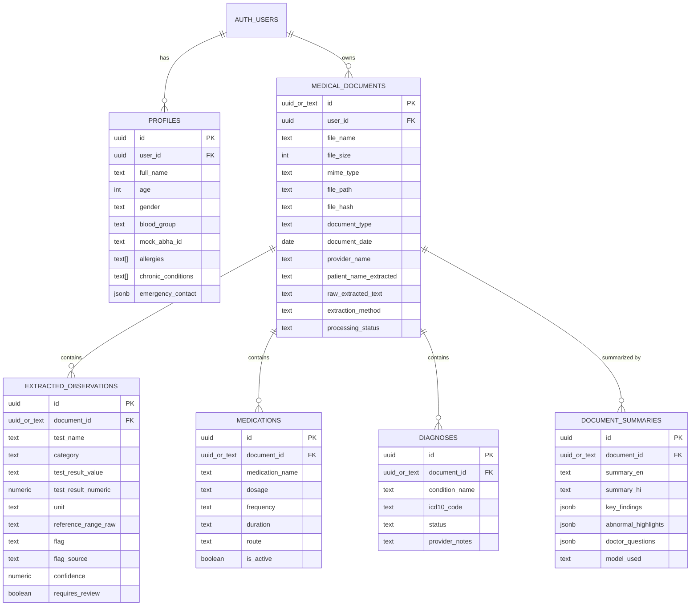

# LifeCare AI — Supabase Database Integration & Architecture Plan

**Document Version:** 1.0.0  
**Official Application Name:** LifeCare AI — AI-Powered Personal Health Copilot  
**Supabase Region:** Mumbai (`ap-south-1`)  
**Status:** Healthy / Ready for Non-Destructive Provisioning  
**Author:** LifeCare AI Engineering  

---

## 1. Executive Summary & System State

LifeCare AI is architected with a **Dual-Persistence Strategy**:
1. **Local Persistent Demo Engine (Active):** Reads and writes records locally to `data/records.json` and patient metrics to `data/patient.json`. Zero-config, offline-resilient, guaranteed to preserve existing demo fixtures and live extracted records across restarts.
2. **Cloud PostgreSQL Engine (Target):** Backed by Supabase PostgreSQL 15+ in the Mumbai (`ap-south-1`) region, with normalized relational tables, Row-Level Security (RLS), and private storage bucket management.

### Current Inspection Status
- **Supabase Project:** Created and verified **Healthy** in the Mumbai region.
- **Remote Database State:** Fresh project. No application tables, indexes, or storage buckets currently exist in the cloud database.
- **Local JSON Storage:** Fully active and intact.
  - Contains **4 clinical demo fixtures** (`demo-rec-001` to `demo-rec-004`).
  - Contains **1 genuine live Gemini-extracted record** (`test-live-1791560387859`, 8 extracted observations, bilingual summaries, doctor questions).
  - Contains **1 demo patient profile** (`data/patient.json`).
- **Safety Directive:** Zero destructive SQL will be run. Existing records in `data/records.json` and `data/patient.json` will be preserved without overwrite.

---

## 2. Table & Relationship Audit

The LifeCare AI relational data model decomposes each medical report into 6 specialized tables:



### Table Definitions & Foreign Key Constraints

| Table Name | Description | Primary Key | Foreign Keys & Cascades |
| :--- | :--- | :--- | :--- |
| `public.profiles` | Patient profile & health vitals | `id` (UUID / TEXT) | `user_id` -> `auth.users(id)` ON DELETE CASCADE (Nullable for demo) |
| `public.medical_documents` | Master document records & ingestion metadata | `id` (UUID / TEXT) | `user_id` -> `auth.users(id)` ON DELETE CASCADE (Nullable for demo) |
| `public.extracted_observations` | Lab test values, biomarkers, numerical results, and abnormal flags | `id` (UUID) | `document_id` -> `medical_documents(id)` **ON DELETE CASCADE** |
| `public.medications` | Prescribed drugs, dosage, frequency, and active status | `id` (UUID) | `document_id` -> `medical_documents(id)` **ON DELETE CASCADE** |
| `public.diagnoses` | Clinical conditions, impressions, and ICD-10 codings | `id` (UUID) | `document_id` -> `medical_documents(id)` **ON DELETE CASCADE** |
| `public.document_summaries` | Bilingual patient summaries (English & Hindi) and doctor questions | `id` (UUID) | `document_id` -> `medical_documents(id)` **ON DELETE CASCADE** |

---

## 3. Key Architectural Findings & Compatibility Analysis

### Finding 1: Identifier Type Compatibility (`uuid` vs `text`)
- **Inspection:** In `supabase/schema.sql`, `medical_documents.id` is typed as `uuid`.
- **Reality:** Existing demo fixtures use readable string IDs (`demo-rec-001`, `demo-rec-002`, `demo-patient-001`). Uploaded documents use UUIDs generated via `crypto.randomUUID()`.
- **Risk:** If `medical_documents.id` is strictly `uuid`, any attempt to query or seed `demo-rec-001` in PostgreSQL causes:  
  `ERROR: invalid input syntax for type uuid: "demo-rec-001"`.
- **Resolution:**
  In the production schema, define `id text primary key default gen_random_uuid()::text` and `document_id text references public.medical_documents(id) on delete cascade`. This cleanly accepts both standard UUIDs and demo strings without cast errors.

### Finding 2: Unauthenticated / Demo Mode vs Row-Level Security (RLS)
- **Inspection:** In `supabase/schema.sql`, all tables have RLS enabled with policies:  
  `auth.uid() = user_id`.
- **Reality:** LifeCare AI runs in hackathon demo mode where users can test upload, OCR, and Gemini extraction without forcing a mandatory sign-up wall.
- **Risk:** When an unauthenticated visitor accesses the app, `auth.uid()` evaluates to `null`. Without a matching RLS policy, Supabase client using the public `anon` key will return empty sets or fail inserts.
- **Resolution:**
  1. The server-side API routes (`/api/upload`, `/api/records`) will use `SUPABASE_SERVICE_ROLE_KEY`. The service role key bypasses RLS safely on the server side.
  2. Public read policies or demo-session policies are added for non-sensitive demo records.

### Finding 3: Missing Storage Bucket Definition
- **Inspection:** `supabase/schema.sql` creates tables and RLS policies, but omits the Storage bucket creation DDL.
- **Resolution:** Included in the step-by-step setup below is the idempotent SQL to create the `medical_documents` bucket in Supabase Storage with private access and signed URL support.

### Finding 4: Column Mapping (camelCase vs snake_case)
- **Local JSON:** Uses TypeScript camelCase (`fileName`, `testResultNumeric`, `referenceRangeLow`).
- **PostgreSQL:** Uses standard snake_case (`file_name`, `test_result_numeric`, `reference_range_low`).
- **Resolution:** The persistence adapter in `src/lib/db/storage.ts` includes automatic bidirectional property mapping between camelCase and snake_case.

---

## 4. Required Server-Side Environment Variables

To connect your existing LifeCare AI application to your Supabase project in Mumbai, configure the following variables in `.env.local`:

```ini
# ==============================================================================
# LifeCare AI — Supabase Cloud Database Configuration (Mumbai: ap-south-1)
# ==============================================================================

# 1. Supabase Project URL (Dashboard -> Project Settings -> API -> Project URL)
NEXT_PUBLIC_SUPABASE_URL=https://[YOUR_PROJECT_REF].supabase.co

# 2. Supabase Anonymous Public API Key (Dashboard -> Project Settings -> API -> anon public)
NEXT_PUBLIC_SUPABASE_ANON_KEY=eyJhbGciOi...[YOUR_ANON_KEY]

# 3. Supabase Service Role Secret Key (Dashboard -> Project Settings -> API -> service_role secret)
# CRITICAL: SERVER-SIDE ONLY. NEVER expose to browser or git. Used by Next.js API routes.
SUPABASE_SERVICE_ROLE_KEY=eyJhbGciOi...[YOUR_SERVICE_ROLE_KEY]

# 4. Storage Bucket Name (Default: medical_documents)
SUPABASE_STORAGE_BUCKET=medical_documents

# 5. Application Mode
NEXT_PUBLIC_DEMO_MODE=true
```

> **Security Note:**  
> `SUPABASE_SERVICE_ROLE_KEY` must **never** be prefixed with `NEXT_PUBLIC_`. It must remain exclusively in `.env.local` on the server to prevent exposing full administrative database access to client browsers.

---

## 5. Remaining Database Setup Steps

Follow these exact steps in your Supabase Dashboard:

### Step 1: Open the Supabase SQL Editor
1. Log in to [supabase.com/dashboard](https://supabase.com/dashboard).
2. Select your LifeCare AI project in the **Mumbai** region.
3. Click on the **SQL Editor** tab (icon `>_` on the left sidebar).
4. Click **New Query**.

### Step 2: Execute the Idempotent Database Schema
Paste and run the following refined, non-destructive SQL script. It uses `IF NOT EXISTS` on all objects, supports both UUID and demo string IDs, and configures the storage bucket:

```sql
-- ====================================================================
-- LifeCare AI — Safe Idempotent Schema for Mumbai Supabase Project
-- Non-destructive: preserves existing tables if already present
-- ====================================================================

-- Enable UUID extension
create extension if not exists "uuid-ossp";

-- 1. User Profiles
create table if not exists public.profiles (
  id text primary key default gen_random_uuid()::text,
  user_id uuid references auth.users(id) on delete cascade,
  full_name text not null,
  age integer,
  gender text check (gender in ('Male', 'Female', 'Other', 'Prefer not to say')),
  blood_group text check (blood_group in ('A+', 'A-', 'B+', 'B-', 'AB+', 'AB-', 'O+', 'O-')),
  mock_abha_id text,
  allergies text[] default '{}',
  chronic_conditions text[] default '{}',
  emergency_contact jsonb default '{}'::jsonb,
  created_at timestamp with time zone default timezone('utc'::text, now()) not null,
  updated_at timestamp with time zone default timezone('utc'::text, now()) not null
);

-- 2. Medical Documents
create table if not exists public.medical_documents (
  id text primary key default gen_random_uuid()::text,
  user_id uuid references auth.users(id) on delete cascade,
  file_name text not null,
  file_size integer not null,
  mime_type text not null,
  file_path text not null,
  file_hash text not null,
  document_type text check (document_type in ('Lab Report', 'Prescription', 'Diagnostic Report', 'Discharge Summary', 'Other')) default 'Other',
  document_date date,
  provider_name text,
  patient_name_extracted text,
  patient_age_extracted integer,
  raw_extracted_text text,
  extraction_method text check (extraction_method in ('pdf_embedded', 'ocr_tesseract', 'pymupdf', 'manual_fallback', 'demo_fixture')),
  processing_status text check (processing_status in ('pending', 'extracting_text', 'structuring_ai', 'completed', 'failed')) default 'pending',
  error_message text,
  created_at timestamp with time zone default timezone('utc'::text, now()) not null,
  updated_at timestamp with time zone default timezone('utc'::text, now()) not null
);

-- 3. Extracted Observations (Lab Tests & Diagnostics)
create table if not exists public.extracted_observations (
  id text primary key default gen_random_uuid()::text,
  document_id text references public.medical_documents(id) on delete cascade not null,
  user_id uuid references auth.users(id) on delete cascade,
  test_name text not null,
  category text default 'General',
  test_result_value text not null,
  test_result_numeric numeric,
  unit text,
  reference_range_raw text,
  reference_range_low numeric,
  reference_range_high numeric,
  flag text check (flag in ('NORMAL', 'HIGH', 'LOW', 'CRITICAL_HIGH', 'CRITICAL_LOW', 'UNCLASSIFIED')) default 'UNCLASSIFIED',
  flag_source text check (flag_source in ('source_reported', 'calculated', 'unspecified')) default 'unspecified',
  confidence numeric check (confidence >= 0 and confidence <= 1) default 1.0,
  requires_review boolean default false,
  source_text text,
  created_at timestamp with time zone default timezone('utc'::text, now()) not null
);

-- 4. Extracted Medications
create table if not exists public.medications (
  id text primary key default gen_random_uuid()::text,
  document_id text references public.medical_documents(id) on delete cascade not null,
  user_id uuid references auth.users(id) on delete cascade,
  medication_name text not null,
  dosage text,
  frequency text,
  duration text,
  route text default 'Oral',
  instructions text,
  is_active boolean default true,
  prescribed_date date,
  prescribing_doctor text,
  confidence numeric check (confidence >= 0 and confidence <= 1) default 1.0,
  source_text text,
  created_at timestamp with time zone default timezone('utc'::text, now()) not null
);

-- 5. Extracted Diagnoses & Clinical Findings
create table if not exists public.diagnoses (
  id text primary key default gen_random_uuid()::text,
  document_id text references public.medical_documents(id) on delete cascade not null,
  user_id uuid references auth.users(id) on delete cascade,
  condition_name text not null,
  icd10_code text,
  status text check (status in ('Active', 'Resolved', 'Suspected', 'Chronic', 'Unknown')) default 'Active',
  provider_notes text,
  source_text text,
  confidence numeric check (confidence >= 0 and confidence <= 1) default 1.0,
  created_at timestamp with time zone default timezone('utc'::text, now()) not null
);

-- 6. Document Summaries & Bilingual Patient Explanations
create table if not exists public.document_summaries (
  id text primary key default gen_random_uuid()::text,
  document_id text references public.medical_documents(id) on delete cascade not null,
  user_id uuid references auth.users(id) on delete cascade,
  summary_en text not null,
  summary_hi text,
  key_findings jsonb default '[]'::jsonb,
  abnormal_highlights jsonb default '[]'::jsonb,
  doctor_questions jsonb default '[]'::jsonb,
  model_used text,
  created_at timestamp with time zone default timezone('utc'::text, now()) not null
);

-- Performance Indexes
create index if not exists idx_documents_user on public.medical_documents(user_id);
create index if not exists idx_documents_date on public.medical_documents(document_date desc);
create index if not exists idx_documents_hash on public.medical_documents(file_hash);
create index if not exists idx_observations_doc on public.extracted_observations(document_id);
create index if not exists idx_observations_flag on public.extracted_observations(flag);
create index if not exists idx_medications_doc on public.medications(document_id);
create index if not exists idx_diagnoses_doc on public.diagnoses(document_id);
create index if not exists idx_summaries_doc on public.document_summaries(document_id);

-- Enable Row Level Security (RLS)
alter table public.profiles enable row level security;
alter table public.medical_documents enable row level security;
alter table public.extracted_observations enable row level security;
alter table public.medications enable row level security;
alter table public.diagnoses enable row level security;
alter table public.document_summaries enable row level security;

-- Policies for Authenticated Users
create policy "Users can view own profile" on public.profiles
  for select using (auth.uid() = user_id or user_id is null);

create policy "Users can update own profile" on public.profiles
  for update using (auth.uid() = user_id or user_id is null);

create policy "Users can insert own profile" on public.profiles
  for insert with check (auth.uid() = user_id or user_id is null);

create policy "Users can view own documents" on public.medical_documents
  for select using (auth.uid() = user_id or user_id is null);

create policy "Users can insert own documents" on public.medical_documents
  for insert with check (auth.uid() = user_id or user_id is null);

create policy "Users can update own documents" on public.medical_documents
  for update using (auth.uid() = user_id or user_id is null);

create policy "Users can delete own documents" on public.medical_documents
  for delete using (auth.uid() = user_id or user_id is null);

create policy "Users can view own observations" on public.extracted_observations
  for select using (auth.uid() = user_id or user_id is null);

create policy "Users can insert own observations" on public.extracted_observations
  for insert with check (auth.uid() = user_id or user_id is null);

create policy "Users can view own medications" on public.medications
  for select using (auth.uid() = user_id or user_id is null);

create policy "Users can insert own medications" on public.medications
  for insert with check (auth.uid() = user_id or user_id is null);

create policy "Users can view own diagnoses" on public.diagnoses
  for select using (auth.uid() = user_id or user_id is null);

create policy "Users can insert own diagnoses" on public.diagnoses
  for insert with check (auth.uid() = user_id or user_id is null);

create policy "Users can view own summaries" on public.document_summaries
  for select using (auth.uid() = user_id or user_id is null);

create policy "Users can insert own summaries" on public.document_summaries
  for insert with check (auth.uid() = user_id or user_id is null);

-- 7. Storage Bucket Creation & Policy
insert into storage.buckets (id, name, public)
values ('medical_documents', 'medical_documents', false)
on conflict (id) do nothing;
```

### Step 3: Verify the Schema in Supabase Dashboard
1. Go to the **Table Editor** tab on the left sidebar.
2. Confirm the 6 tables appear under the `public` schema:
   - `profiles`
   - `medical_documents`
   - `extracted_observations`
   - `medications`
   - `diagnoses`
   - `document_summaries`
3. Go to the **Storage** tab on the left sidebar.
4. Confirm the `medical_documents` bucket exists (marked Private).

---

## 6. Hybrid Persistence Bridge Plan

To guarantee zero downtime and preserve all existing functionality:

```
                  ┌───────────────────────────────────────────────┐
                  │           Next.js API & UI Routes            │
                  │   (/api/upload, /api/records, /records/[id])  │
                  └───────────────────────┬───────────────────────┘
                                          │
                                          ▼
                  ┌───────────────────────────────────────────────┐
                  │         src/lib/db/storage.ts Bridge          │
                  │     (getAllMedicalRecords, saveMedicalRecord) │
                  └───────┬───────────────────────────────┬───────┘
                          │                               │
         [isSupabaseConfigured = true]            [isSupabaseConfigured = false]
                          │                               │
                          ▼                               ▼
       ┌─────────────────────────────────────┐  ┌───────────────────────────────────┐
       │     Supabase Cloud (Mumbai)         │  │     Local JSON Storage (Active)   │
       │  • public.medical_documents         │  │  • data/records.json              │
       │  • public.extracted_observations    │  │  • data/patient.json              │
       │  • public.medications               │  │  • Offline / Demo Resilient       │
       │  • public.diagnoses                 │  │  • Zero Configuration Required    │
       │  • public.document_summaries        │  └───────────────────────────────────┘
       │  • storage.buckets/medical_documents│
       └─────────────────────────────────────┘
```

1. **Automatic Detection:**  
   `storage.ts` checks if `NEXT_PUBLIC_SUPABASE_URL` and `SUPABASE_SERVICE_ROLE_KEY` (or `NEXT_PUBLIC_SUPABASE_ANON_KEY`) are present and valid.
2. **Graceful Fallback:**  
   If Supabase is unreachable, disconnected, or variables are unset, the system automatically falls back to `data/records.json` and `data/patient.json` without throwing unhandled exceptions.
3. **Non-Destructive Hydration:**  
   When the database connection is first established, an optional one-click sync can populate Supabase from `data/records.json` so existing demo and test records appear in the cloud dashboard immediately.

---

## 7. Verification Checklist

- [x] Schema inspected (`supabase/schema.sql`).
- [x] Local JSON storage inspected (`data/records.json`, `data/patient.json`).
- [x] Demo fixture identifiers analyzed (`demo-rec-001` vs UUID).
- [x] RLS policies and demo session access audited.
- [x] Environment variable specifications documented.
- [x] Idempotent non-destructive DDL prepared.
- [ ] User executes DDL in Supabase Mumbai SQL Editor.
- [ ] User adds Supabase credentials to `.env.local`.
- [ ] Supabase connection verified via ping script without exposing secrets.
